# 23127364_HW01_AI_100 Report

## 1. Requirement 1 – 10 Job Postings for QA/QC/Tester Roles 

### Vị trí 01: Process Quality Assurance (QA QC, Agile/Scrum, Jira)
* **Đường dẫn (Link):** [https://itviec.com/it-jobs/process-quality-assurance-qa-qc-agile-scrum-jira-sabitech-cong-ty-co-phan-cong-nghe-sabi-1415?lab_feature=preview_jd_page]
* **Mức lương (Salary):** 800 - 1,300 USD
* **Mô tả công việc (Job Description):**
    - Theo dõi và đảm bảo các dự án tuân thủ quy trình phát triển phần mềm và quy định chất lượng của công ty.
    - Phối hợp với PM/Team để kiểm soát tiến độ, chất lượng và quản lý các rủi ro trong quá trình triển khai dự án.
    - Theo dõi task, timeline, quality checkpoints và hỗ trợ thúc đẩy dự án vận hành đúng kế hoạch.Hỗ trợ kiểm tra, đánh giá process compliance và đề xuất cải tiến nhằm nâng cao hiệu quả vận hành dự án.
    - Hỗ trợ triển khai, đào tạo và duy trì các quy trình nội bộ, tiêu chuẩn chất lượng trong công ty.
    - Phối hợp với các bộ phận liên quan để nâng cao chất lượng sản phẩm và tối ưu quy trình làm việc.
* **Kỹ năng yêu cầu (Required Skills):** ISTQB Foundation, SQL, Prompt Engineering, ChatGPT/Claude.
* **Phân tích tác động của AI (AI Impact Analysis):** Vị trí PQA (Process Quality Assurance) tập trung mạnh vào việc giám sát quy trình, giao tiếp liên phòng ban và thúc đẩy con người. AI hiện nay có thể hỗ trợ vị trí này trong việc tự động hóa thu thập dữ liệu báo cáo, phân tích biểu đồ tiến độ (Jira/Excel) hoặc dự đoán rủi ro chậm deadline dựa trên lịch sử dự án. Tuy nhiên, các kỹ năng cốt lõi như đánh giá độ tuân thủ (compliance), xử lý xung đột giữa các team, đào tạo quy trình nội bộ và tư duy cải tiến hệ thống tinh gọn vẫn đòi hỏi sự khéo léo, trí tuệ cảm xúc (EQ) và năng lực quản trị của con người mà AI chưa thể thay thế.
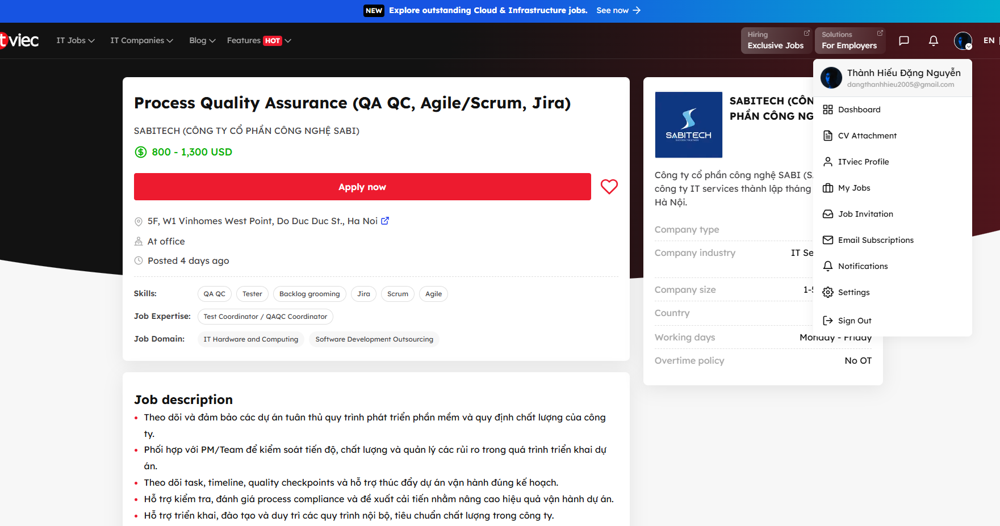

### Vị trí 02: Senior/Lead QA Engineer (QE, QC, Automation)
* **Đường dẫn (Link):** [https://itviec.com/it-jobs/senior-lead-qa-engineer-qe-qc-automation-pizza-hut-digital-technology-3057?lab_feature=preview_jd_page]
* **Mức lương (Salary):** Negotiable
* **Mô tả công việc (Job Description):**
    - Xác định và thúc đẩy chiến lược kiểm thử tổng thể cũng như các tiêu chuẩn chất lượng cho nền tảng thương mại điện tử Byte by Yum!.
    - Dẫn dắt chiến lược tự động hóa (automation), đảm bảo các framework kiểm thử có khả năng mở rộng và dễ bảo trì trên cả nền tảng web và thiết bị di động.
    - Thiết lập các thực hành tốt nhất (best practices) cho kiểm thử chức năng, tích hợp, đầu cuối (end-to-end) và kiểm thử hiệu năng.
    - Hỗ trợ triển khai, đào tạo và duy trì các quy trình nội bộ, tiêu chuẩn chất lượng trong công ty.
    - Phối hợp chặt chẽ với các đội ngũ Kỹ thuật (Engineering), Sản phẩm (Product) và DevOps để nhúng quy trình đảm bảo chất lượng vào đường ống CI/CD và vòng đời phát triển phần mềm.
* **Kỹ năng yêu cầu (Required Skills):** QA QC, Automation Test, Automation Test Frameworks, Leadership, English communication, CI/CD pipeline.
* **Phân tích tác động của AI (AI Impact Analysis):** Khả năng hỗ trợ: Mặc dù JD không yêu cầu kỹ năng AI, nhưng thực tế các công cụ Generative AI có thể hỗ trợ vị trí này tối ưu hóa việc viết script test tự động (Selenium, Playwright...) và tự động hóa việc tạo hàng loạt test scenario cho hệ thống E-commerce, giúp tăng tốc độ xử lý tác vụ kỹ thuật thô. Khả năng thay thế rất thấp vì  \AI hoàn toàn không thể thay thế con người ở vị trí này. Lý do là công việc yêu cầu kỹ năng Leadership để quản lý các đội nhóm phân tán toàn cầu, tư duy chiến lược để định hình tiêu chuẩn chất lượng cho một nền tảng lớn, và khả năng kết nối liên chức năng như DevOps, Product. Đây đều là những kỹ năng mềm và quản trị cốt lõi mà AI chưa thể đảm nhiệm. Con người vẫn đóng vai trò tối cao trong việc thẩm định tính đúng đắn của framework và quản lý quy trình.
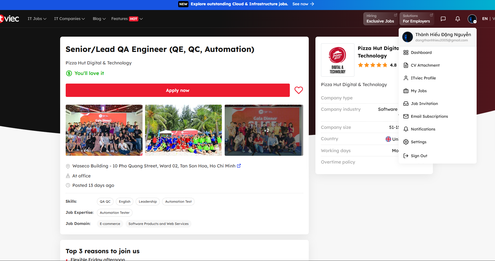

### Vị trí 03: Automation QA Engineer (QA QC/Tester/Automation Test)
* **Đường dẫn (Link):** [https://itviec.com/it-jobs/automation-qa-engineer-qa-qc-tester-automation-test-nakivo-0115?lab_feature=preview_jd_page]
* **Mức lương (Salary):** 1,100 - 1,500 USD
* **Mô tả công việc (Job Description):**
    - Hợp tác với các nhà phát triển phần mềm và đội ngũ QA để hiểu rõ yêu cầu dự án và tính năng hệ thống.
    - Thiết kế, phát triển và thực thi các kịch bản kiểm thử tự động (test scripts) bằng các công cụ chuẩn công nghiệp.
    - Thiết kế, tạo và quản lý các ca kiểm thử tự động (automation test cases) ứng dụng công nghệ AI.
    - Phát hiện, báo cáo lỗi phần mềm một cách rõ ràng, ngắn gọn và phối hợp xử lý lỗi với các đội ngũ liên quan.
* **Kỹ năng yêu cầu (Required Skills):** Selenium, Java, Python, C#, Git, API Testing (Postman/RestAssured), Kiến thức về Cloud (AWS, VMware, Hyper-V), Kỹ năng kiểm thử tự động bằng AI (Copilot, Cursor, Perplexity).
* **Phân tích tác động của AI (AI Impact Analysis):** Vị trí này cho thấy rõ xu hướng "AI-augmented" (AI tăng cường) trong mảng Automation Test. AI (thông qua các công cụ như Copilot, Cursor) đóng vai trò trợ lý đắc lực, hỗ trợ kỹ sư viết code tự động nhanh hơn, tối ưu cấu trúc framework và sinh các kịch bản kiểm thử tự động một cách thông minh. Tuy nhiên, AI không thay thế được con người; kỹ sư QA vẫn đóng vai trò cốt lõi trong việc thiết lập tư duy logic hệ thống, kiểm soát hạ tầng cloud phức tạp (VMware, AWS) và thẩm định tính chính xác của các đoạn mã kiểm thử do AI gợi ý.
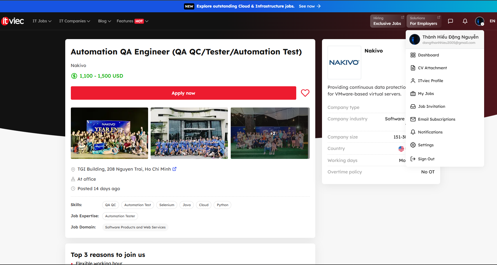

### Vị trí 04: Senior QC (Automation Tester, QA QC)
* **Đường dẫn (Link):** [https://itviec.com/it-jobs/senior-qc-automation-tester-qa-qc-pnj-5542?lab_feature=preview_jd_page]
* **Mức lương (Salary):** 1,000 - 1,500 USD
* **Mô tả công việc (Job Description):**
    - Kiểm soát chất lượng truyền thống và AI: Phân tích đặc tả yêu cầu; lập kế hoạch và thực hiện kiểm thử chức năng, UI/UX, hành vi AI; kiểm tra các tình huống edge case, misuse, rủi ro nghiệp vụ; đánh giá độ chính xác, tin cậy và tính công bằng của kết quả AI.
    - Kiểm thử tự động và công cụ AI: Phát triển kịch bản test automation; áp dụng các công cụ kiểm thử AI (LLM evaluation, synthetic data); thiết lập hệ thống CI/CD; phát triển công cụ nội bộ hỗ trợ kiểm thử AI.
    - Đảm bảo chất lượng dữ liệu cho AI: Kiểm tra tính đầy đủ, chính xác, đa dạng của dữ liệu huấn luyện; giám sát bảo mật dữ liệu cá nhân và theo dõi hiệu suất mô hình AI theo thời gian.
* **Kỹ năng yêu cầu (Required Skills):** Tối thiểu 04 năm kinh nghiệm Software Testing Automation (có ứng dụng AI trong testing), tư duy end-user, phân tích rủi ro hệ thống. Điểm cộng: Chứng chỉ ISTQB, Agile hoặc tương đương.
* **Phân tích tác động của AI (AI Impact Analysis):** Vị trí này phản ánh một bước chuyển dịch lớn: AI không còn là công cụ hỗ trợ (Augmented) mà đã trở thành đối tượng kiểm thử chính (Testing AI Products). Công việc đòi hỏi kỹ sư không chỉ biết dùng AI để viết code automation nhanh hơn, mà phải có năng lực đánh giá chuyên sâu về mô hình (LLM evaluation), xử lý dữ liệu huấn luyện (Data Quality) và kiểm soát các lỗi đặc thù của AI như thiên kiến (fairness) hay ảo tưởng (hallucination). Con người đóng vai trò quyết định trong việc thiết lập "hàng rào quản trị" để đảm bảo AI hoạt động an toàn và chuẩn xác.
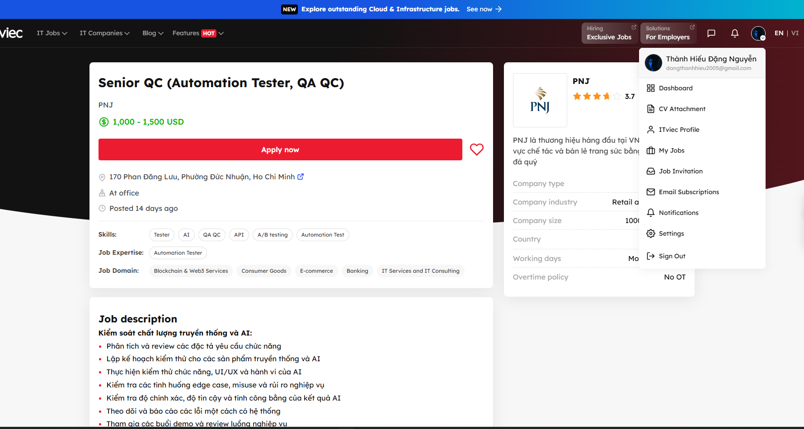

### Vị trí 05: Software Tester (QA QC, SQL)
* **Đường dẫn (Link):** [https://itviec.com/it-jobs/software-tester-qa-qc-sql-gene-solutions-0129?lab_feature=preview_jd_page]
* **Mức lương (Salary):** Nogotiable
* **Mô tả công việc (Job Description):**
    - Phân tích nghiệp vụ & Xây dựng kịch bản: Nghiên cứu kỹ luồng vận hành (Workflow), tài liệu yêu cầu để viết Test Plan và thiết kế chi tiết bộ Test Case cho các tính năng/thay đổi của hệ thống.
    - Thực hiện kiểm thử: Tiến hành kiểm thử chức năng (Functional), phân quyền (Role-based), giao diện (UI/UX) và kiểm tra dữ liệu trên các trình duyệt Web phổ biến (Chrome, Edge, Firefox, Safari).
    - Quản lý lỗi & Nghiệm thu: Phát hiện, phân tích nguyên nhân, log lỗi lên hệ thống. Theo dõi tiến độ sửa lỗi, thực hiện Re-test, Regression Test và viết báo cáo chất lượng. Hỗ trợ người dùng làm kiểm thử nghiệm thu (UAT).
    - Kiểm tra dữ liệu: Thực hiện truy vấn cơ sở dữ liệu để đối chiếu và xác bóc dữ liệu hiển thị trên Web App đúng với cơ sở dữ liệu.
* **Kỹ năng yêu cầu (Required Skills):** 1 - 3 năm kinh nghiệm Manual QC; thiết kế test plan/test case; SQL cơ bản - khá (Select, Join...); Postman (API test); Tiếng Anh đọc hiểu.(Copilot, Cursor, Perplexity).
* **Phân tích tác động của AI (AI Impact Analysis):** Vị trí này hiện tại là một công việc Manual QC thuần túy truyền thống trong lĩnh vực Y tế (Healthcare), bản mô tả công việc chưa đề cập trực tiếp đến việc ứng dụng các công cụ Generative AI. Tuy nhiên, nhìn từ góc độ tối ưu hóa, AI hoàn toàn có thể tác động mạnh mẽ vào hai mảng:
    * Thiết kế Test Case từ Workflow: Kỹ sư có thể dùng AI (như ChatGPT/Claude) để nhập luồng vận hành phức tạp của hệ thống y tế và yêu cầu AI sinh ra các kịch bản kiểm thử (Test scenarios) bao quát, giúp giảm 40-50% thời gian suy nghĩ kịch bản thô.

    * Hỗ trợ viết SQL và API Script: Với yêu cầu truy vấn SQL mức cơ bản-khá và test API bằng Postman, AI đóng vai trò như một trợ lý đắc lực giúp QC sinh nhanh các câu lệnh Query phức tạp (như nhiều tầng Join) hoặc viết các đoạn script test tự động trong Postman.

Dù vậy, do đặc thù ngành Healthcare đòi hỏi độ chính xác cực cao về dữ liệu khách hàng/bệnh nhân, tư duy logic để kiểm soát logic nội bộ và kỹ năng giao tiếp trực tiếp với Developer/User trong quá trình UAT vẫn là giá trị cốt lõi của con người mà AI chưa thể thay thế tại vị trí này.
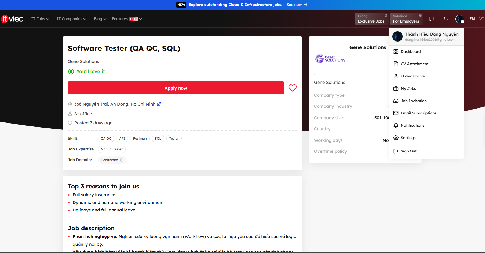


### Vị trí 06: Manual/Automation Tester - Quality Analyst (QA QC)
* **Đường dẫn (Link):** [https://itviec.com/it-jobs/manual-automation-tester-quality-analyst-qa-qc-mitek-vietnam-0005?lab_feature=preview_jd_page]
* **Mức lương (Salary):** Competitive
* **Mô tả công việc (Job Description):**
    - Thiết kế, phát triển, tài liệu hóa, đào tạo và thực hiện các test case phức tạp cho chu kỳ kiểm thử hồi quy (regression testing).
    - Kiểm thử chức năng (functional testing) các tính năng mới và kiểm thử hồi quy các tính năng hiện có cho mỗi đợt phát hành phần mềm mới.
    - Tham gia họp với các bên liên quan (Stakeholders); phối hợp với các đội ngũ tại Việt Nam và Mỹ để đánh giá, làm rõ yêu cầu và thiết kế sản phẩm.
    - Kiểm thử các ứng dụng trên nền tảng Windows và thực hiện log/báo cáo lỗi (bugs) trong quy trình làm việc Agile.
* **Kỹ năng yêu cầu (Required Skills):** 3-5 năm kinh nghiệm làm QA, thành thạo tiếng Anh, có kiến thức về quy trình/kỹ thuật test và kinh nghiệm test ứng dụng Windows. Kỹ năng SQL, Agile tốt. (Điểm cộng: Có kinh nghiệm test automation cho Window apps/API và kiến thức về phần mềm ngành Xây dựng nhà ở - Home Building).
* **Phân tích tác động của AI (AI Impact Analysis):** Mặc dù mô tả công việc (JD) hiện tại của MiTek chưa đề cập trực tiếp đến việc sử dụng các công cụ Generative AI, xu hướng tích hợp AI trong vị trí này là rất lớn. Do tính chất công việc tập trung mạnh vào kiểm thử thủ công (Manual Test Focus) kết hợp với các hệ thống phần mềm đặc thù (Window Applications ngành Home Building), AI có thể đóng vai trò trợ lý giúp tự động hóa việc viết tài liệu kiểm thử và gợi ý các kịch bản test case phức tạp dựa trên yêu cầu sản phẩm ban đầu. Tuy nhiên, vì dự án yêu cầu sự phối hợp chặt chẽ giữa các team global (Việt Nam & Mỹ) để làm rõ yêu cầu nghiệp vụ phức tạp, năng lực cốt lõi của con người như tư duy logic, kỹ năng giao tiếp, hiểu biết sâu sắc về domain kiến thức (ngành xây dựng) và khả năng ra quyết định cuối cùng vẫn là yếu tố then chốt mà AI chưa thể thay thế.
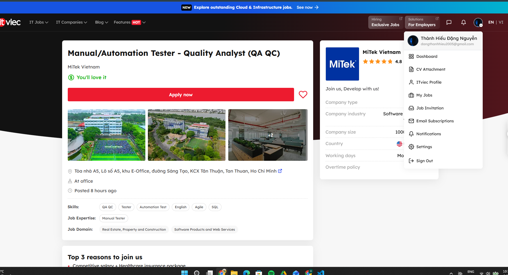

### Vị trí 07: QA Engineer, VibeX-Generated Apps (QA QC, Tester)
* **Đường dẫn (Link):** [https://itviec.com/it-jobs/qa-engineer-vibex-generated-apps-qa-qc-tester-metacrew-5045?lab_feature=preview_jd_page]
* **Mức lương (Salary):** Competitive
* **Mô tả công việc (Job Description):**
    - Kiểm thử toàn diện chất lượng (chức năng, UI, độ phản hồi, hiệu năng, khả năng tiếp cận WCAG) của các ứng dụng web và di động được tạo ra tự động bởi nền tảng AI VibeX.
    - Viết báo cáo lỗi (bug reports), phân loại và phân tích các vấn đề để phân biệt rõ giữa lỗi hệ thống (critical bugs) và giới hạn của AI (AI generation limitations).
    - Sử dụng các công cụ Generative AI (Claude, Gemini,...) để tạo test case tự động, xây dựng kịch bản kiểm thử hồi quy (regression test) cho các sản phẩm có giao diện thay đổi liên tục (generative UI).
    - Phân tích các mô hình lỗi lặp đi lặp lại từ sản phẩm của AI để đề xuất cải tiến prompt và tối ưu hóa đường ống (generation pipeline) của VibeX; phối hợp trực tiếp với đội ngũ kỹ sư toàn cầu.
* **Kỹ năng yêu cầu (Required Skills):** Thành thạo kiểm thử Web/Mobile (HTML/CSS/JS/DevTools) 3-5 năm, sử dụng tốt các công cụ AI (Prompt Engineering) để tạo test case/ tự động hóa và đọc viết tài liệu bằng tiếng Anh.
* **Phân tích tác động của AI (AI Impact Analysis):** Đây cũng là một vị trí minh chứng rõ nét cho mô hình "AI-powered Quality Operator" (Vận hành chất lượng bằng AI) thay vì một QA truyền thống. AI đóng vai trò vừa là "đối tượng kiểm thử" vừa là "đồng nghiệp" hỗ trợ. Tác động lớn nhất là việc xóa bỏ các test case kịch bản cố định, bắt buộc kỹ sư phải dùng AI để đối phó với các đầu ra không định hình trước (non-deterministic UI) của Generative AI. Vai trò của con người lúc này dịch chuyển từ việc "tìm lỗi thủ công" sang "phân tích mô hình lỗi" (pattern analysis) để huấn luyện lại AI và cải tiến Prompt hệ thống. Khả năng làm việc cùng AI (AI capability) đã trở thành tiêu chí tuyển dụng số một, vượt qua cả số năm kinh nghiệm truyền thống.
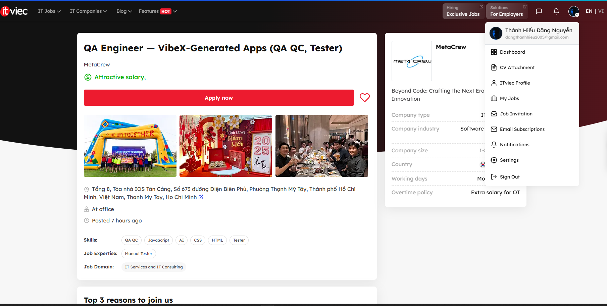

### Vị trí 08: Manual Tester (QA QC/English)
* **Đường dẫn (Link):** [https://itviec.com/it-jobs/manual-tester-qa-qc-english-netcompany-1931?lab_feature=preview_jd_page]
* **Mức lương (Salary):** Negotiable
* **Mô tả công việc (Job Description):**
    - Phân tích và thấu hiểu các yêu cầu kỹ thuật và nghiệp vụ (business) từ khách hàng thuộc nhiều lĩnh vực khác nhau.
    - Phối hợp với đội ngũ dự án để thực hiện kiểm thử các ứng dụng một cách có hệ thống và bài bản.
    - Thiết kế, thực thi và đánh giá (review) các test case dựa trên các yêu cầu về chức năng (functional), phi chức năng (non-functional), kỹ thuật và trải nghiệm người dùng (usability).
    - Quản lý, báo cáo kết quả kiểm thử và tiến độ công việc cá nhân.
    - Phát hiện, quản lý lỗi (defects), đánh giá mức độ nghiêm trọng cũng như tầm ảnh hưởng của lỗi đối với giải pháp và phạm vi dự án.
* **Kỹ năng yêu cầu (Required Skills):** Tốt nghiệp Đại học/Thạc sĩ chuyên ngành CNTT, tiếng Anh giao tiếp và viết tốt (quy trình phỏng vấn 100% bằng tiếng Anh), nắm vững lý thuyết và phương pháp kiểm thử thủ công, có kinh nghiệm sử dụng các công cụ quản lý test và tracking lỗi, chứng chỉ ISTQB là một điểm cộng.
* **Phân tích tác động của AI (AI Impact Analysis):** Bản mô tả công việc hiện tại của Netcompany vẫn tập trung hoàn toàn vào các kỹ năng kiểm thử truyền thống (Manual Testing chuyên sâu) và kỹ năng mềm như làm việc trong môi trường Agile quốc tế, giao tiếp tiếng Anh với khách hàng. Tuy JD chưa đề cập trực tiếp đến việc sử dụng các công cụ Generative AI, nhưng môi trường làm việc tại đây rất chú trọng cập nhật công nghệ mới ("opportunity to work with the latest technologies"). Trong bối cảnh hiện tại, AI có thể hỗ trợ tối ưu ở bước phân tích yêu cầu nghiệp vụ phức tạp của khách hàng châu Âu và tăng tốc độ viết tài liệu/test case bằng tiếng Anh. Mặc dù vậy, vai trò cốt lõi của kỹ sư con người tại vị trí này vẫn là không thể thay thế, đặc biệt là trong việc tư duy logic để hiểu sâu bài toán của khách hàng, tương tác đa quốc gia và chịu trách nhiệm tối cao cho chất lượng cuối cùng của sản phẩm ("certifying the quality of the solution").
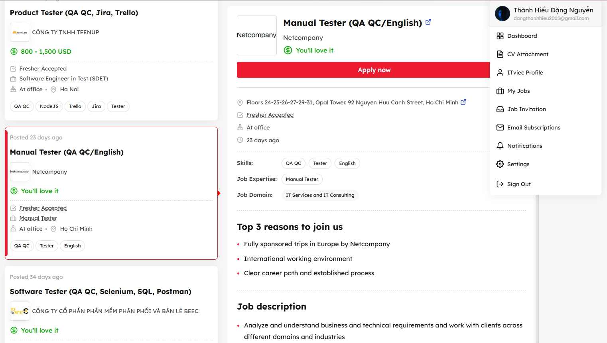

### Vị trí 09: Fresher Full-stack Test Engineer (QA/QC/Tester)
* **Đường dẫn (Link):** [https://vn.indeed.com/jobs?q=qa+qc+tester&l=Th%C3%A0nh+ph%E1%BB%91+H%E1%BB%93+Ch%C3%AD+Minh&from=searchOnDesktopSerp%2Cwhereautocomplete&vjk=105f8525d68c2716]
* **Mức lương (Salary):** Competitive
* **Mô tả công việc (Job Description):**
    - Tìm hiểu kiến thức nghiệp vụ (domain) và quy trình kiểm thử của khách hàng để thực hiện các hoạt động test hiệu quả.
    - Phối hợp chặt chẽ với đội ngũ dự án trong các tác vụ hàng ngày và tham gia các buổi sprint demo với khách hàng.
    - Thiết kế, duy trì và thực thi các test case/test script.
    - Phát hiện, báo cáo và theo dõi tiến độ sửa lỗi (defects) trên hệ thống quản lý lỗi.
    - Chuẩn bị, xem xét các tài liệu kiểm thử và báo cáo tiến độ, rủi ro về chất lượng trực tiếp với khách hàng.
* **Kỹ năng yêu cầu (Required Skills):** Sinh viên năm 4 hoặc mới tốt nghiệp ngành CNTT/Phần mềm (GPA từ 7.5 trở lên). Tiếng Anh lưu loát (Upper-intermediate trở lên) để làm việc trực tiếp với khách hàng nước ngoài. Nền tảng tốt về các phương pháp kiểm thử (Manual, Automation, API, Unit testing) và tư duy lập trình (Python/Java/JavaScript). Điểm cộng: Sử dụng các công cụ AI chat (ChatGPT, Claude, Gemini) để nghiên cứu, fix bug và các trợ lý code AI (GitHub Copilot, Cursor, Claude Code).
* **Phân tích tác động của AI (AI Impact Analysis):** Vị trí Fresher này minh chứng rất rõ xu hướng "AI-native" trong ngành kiểm thử hiện nay. KMS Technology đã đưa kỹ năng tương tác với AI (Prompt Engineering, sử dụng GitHub Copilot/Cursor để sinh test case, tài liệu và code) thành một lợi thế cạnh tranh lớn ngay từ cấp độ Fresher. AI đóng vai trò như một người "mentor kỹ thuật số" giúp các kỹ sư trẻ tăng tốc độ viết code test và nghiên cứu tài liệu. Tuy nhiên, trách nhiệm cốt lõi như quản lý rủi ro rò rỉ dữ liệu khách hàng (data privacy) và việc thẩm định tính chính xác của kết quả do AI tạo ra vẫn đòi hỏi tư duy phản biện và trách nhiệm tối cao từ con người.
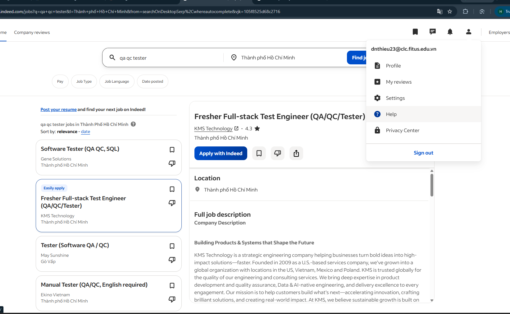

### Vị trí 10: MANUAL & AUTOMATION TESTER
* **Đường dẫn (Link):** [https://topdev.vn/detail-jobs/hn-trung-tam-doi-moi-sang-tao-manual-automation-tester-tong-cong-ty-buu-dien-viet-nam-vietnam-post-2104346?src=topdev_home&medium=superhotjobs]
* **Mức lương (Salary):** 15,000,000 - 45,000,000 VND
* **Mô tả công việc (Job Description):**
    - Nghiên cứu, phân tích tài liệu yêu cầu, thiết kế; tham gia xây dựng kế hoạch kiểm thử, thiết kế và viết testcase, checklist, testplan.
    - Thực hiện kịch bản kiểm thử thủ công (Manual) và chuẩn bị dữ liệu, viết & thực thi các kịch bản kiểm thử tự động (Automation).
    - Tích hợp kiểm thử tự động vào quy trình CI/CD; tham gia kiểm thử hiệu năng và test tải hệ thống khi cần thiết.
    - Phối hợp với Developer để quản lý/sửa lỗi trên Jira; hỗ trợ triển khai, đào tạo người dùng và nghiệm thu khách hàng.
* **Kỹ năng yêu cầu (Required Skills):** Manual Test, Automation Test (Selenium, Cypress, Junit, TestNG, JMeter), Quản lý lỗi (Jira, Confluence, SVN/GitHub), Cơ sở dữ liệu (SQL/NoSQL).
* **Phân tích tác động của AI (AI Impact Analysis):** Mặc dù tin tuyển dụng này chưa yêu cầu trực tiếp các kỹ năng AI (như Prompt Engineering), nhưng đây là môi trường lý tưởng để AI tác động mạnh mẽ. Việc phải đảm nhiệm song song cả Manual lẫn Automation trên các hệ thống rất lớn của Vietnam Post (như AI, Big Data, CRM, ERP, E-commerce) sẽ tạo áp lực lớn về mặt thời gian. AI có thể được ứng dụng để tự động hóa việc sinh các bộ dữ liệu test (Test Data), gợi ý các test case biên phức tạp từ tài liệu nghiệp vụ, hoặc thậm chí hỗ trợ tối ưu/sửa lỗi các đoạn code script Automation (Selenium/Cypress). Tuy nhiên, do tính chất hệ thống cốt lõi phục vụ quốc gia và cộng đồng, tư duy logic của con người để kiểm soát quy trình CI/CD và thẩm định độ chính xác cuối cùng của hệ thống vẫn là yếu tố quyết định không thể thay thế.
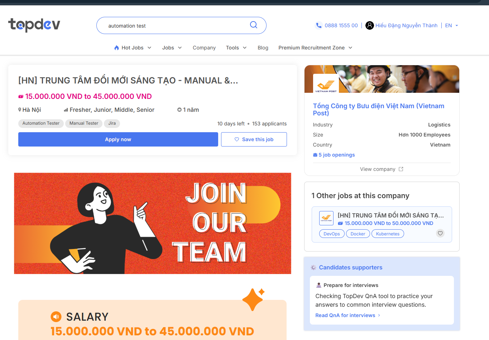

### Vị trí 11: QA / QC Intern
* **Đường dẫn (Link):** [https://www.linkedin.com/jobs/search/?currentJobId=4420929154&f_E=1&keywords=qa%20qc&origin=JOB_SEARCH_PAGE_JOB_FILTER]
* **Mức lương (Salary):** Competitive
* **Mô tả công việc (Job Description):**
    - Thực hiện kiểm thử nghiêm ngặt (Rigorous Testing): Thử nghiệm luồng phỏng vấn bằng AI trên nhiều loại thiết bị di động và trình duyệt khác nhau để tìm ra các lỗi thực tế (Edge cases).
    - Thực hiện kiểm thử nghiêm ngặt (Rigorous Testing): Thử nghiệm luồng phỏng vấn bằng AI trên nhiều loại thiết bị di động và trình duyệt khác nhau để tìm ra các lỗi thực tế (Edge cases).
    - Quản lý phát hành (Release Management): Làm việc trực tiếp với đội ngũ Kỹ thuật và Sản phẩm để phê duyệt xuất bản sản phẩm. Có quyền quyết định "Dừng" không cho ship nếu phát hiện lỗi nghiêm trọng.
    - Cải tiến quy trình và Viết tài liệu chất lượng: Dịch các báo cáo lỗi lộn xộn thành các ticket kỹ thuật rõ ràng, chính xác; chủ động phát hiện lỗ hổng trong quy trình test.
* **Kỹ năng yêu cầu (Required Skills):** Sự tỉ mỉ đến từng chi tiết (Detail-Obsessed), Thành thạo kỹ thuật cơ bản (Biết mở Browser Console/Inspect Element để kiểm tra lỗi network), Tư duy logic cô lập biến để tìm gốc rễ của lỗi, Có sự đồng cảm với người dùng. Điểm cộng: Đam mê sản phẩm công nghệ, phân tích dữ liệu hoặc biết code.
* **Phân tích tác động của AI (AI Impact Analysis):** Tái định hình đối tượng kiểm thử: AI không thay thế con người mà dịch chuyển trọng tâm công việc. Thay vì kiểm thử các logic phần mềm truyền thống, kỹ sư QA chuyển sang đối mặt với một "môi trường thách thức mới" là các sản phẩm tích hợp AI (như AI Speech-to-Text, AI Interview).Tuy nhiên, Các mô hình AI chưa thể tự lường trước biến số thực tế từ thiết bị phần cứng và đường truyền (như lỗi mất mạng giữa chừng, fragmentation trên các dòng điện thoại giá rẻ). Do đó, con người đóng vai trò tối quan trọng để săn tìm các lỗ hổng mà AI bỏ sót. Chuyển dịch từ thực thi sang quyết định (Green-light Authority) với AI có thể hỗ trợ tối ưu dữ liệu hoặc chạy automation, nhưng quyền quyết định "Ship hay không Ship" sản phẩm để đảm bảo trải nghiệm người dùng vẫn phụ thuộc hoàn toàn vào năng lực thẩm định và trách nhiệm của kỹ sư con người.
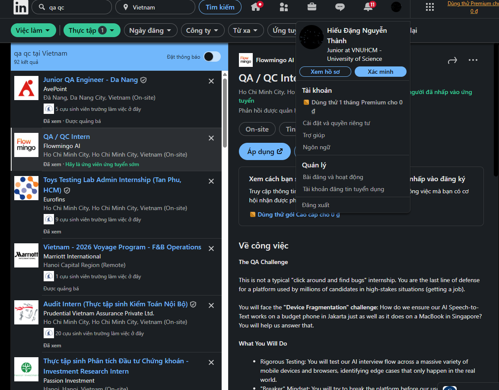


---

## 2. Requirement 2 – 20 Software Defects 2022–2026

### Defect 01: CrowdStrike Falcon Sensor Defective Update (2024)

- **Source:** https://www.crowdstrike.com/blog/falcon-update-for-windows-hosts-technical-details/
- **Mô tả:** Bản cập nhật nội dung (content configuration update) của Falcon Sensor khiến ~8.5 triệu máy Windows bị BSOD và reboot liên tục. Content Validator không phát hiện template khai báo 20 fields nhưng chỉ truyền 21 giá trị, gây out-of-bounds memory read ở kernel driver.
- **Severity:** Critical
- **Hậu quả:** Hàng không, ngân hàng, bệnh viện, truyền thông toàn cầu bị gián đoạn. Được xem là một trong những sự cố CNTT lớn nhất lịch sử.
- **Giải pháp:** Thu hồi bản cập nhật; bổ sung staged rollout cho content update; cải tiến Content Validator để kiểm tra field count khớp với template schema.
- **AI Hallucination/Bias:** AI kết luận đây là "thất bại của toàn bộ quy trình QA", đây là bias overgeneralize. Thực tế root cause là lỗi logic rất cụ thể trong Content Validator (sai field count), không phải thất bại văn hóa tổ chức toàn diện.

---

### Defect 02: ChatGPT Hallucinated Legal Citations (2023–2026)

- **Source:** https://www.reuters.com/legal/new-york-lawyers-sanctioned-using-fake-chatgpt-cases-legal-brief-2023-06-22/
- **Mô tả:** ChatGPT tạo ra các án lệ và tài liệu pháp lý không tồn tại nhưng trình bày như thật. Luật sư nộp hồ sơ chứa citation giả lên tòa án.
- **Severity:** High
- **Hậu quả:** Luật sư bị tòa án xử phạt; hồ sơ pháp lý chứa thông tin giả; mất niềm tin vào AI trong ngành luật.
- **Giải pháp:** Triển khai RAG (Retrieval Augmented Generation) với nguồn pháp lý được xác thực; bắt buộc human review trước khi nộp tài liệu pháp lý.
- **AI Hallucination/Bias:** AI giải thích root cause là "tối ưu xác suất ngôn ngữ", đúng nhưng thiếu chính xác. Vấn đề thực sự là LLM không có cơ chế *grounding*, không có ánh xạ nào giữa token sinh ra và thực thể pháp lý có thật. Đây là vấn đề *closed-book generation without retrieval*, không đơn giản là "tối ưu xác suất".

---

### Defect 03: Google Gemini Image Generation Bias (2024)

- **Source:** https://www.theverge.com/2024/2/21/24079371/google-gemini-ai-image-generation-pause-diversity
- **Mô tả:** Gemini sinh ảnh nhân vật lịch sử sai lệch nhân khẩu học do Google hard-code diversity prompt injection vào pipeline mà không có exception cho các query lịch sử cụ thể.
- **Severity:** High
- **Hậu quả:** Chỉ trích toàn cầu; Google phải tạm dừng tính năng tạo ảnh người trong nhiều tuần.
- **Giải pháp:** Điều chỉnh policy model; thêm context-awareness để nhận diện query lịch sử/địa lý trước khi áp dụng diversity instruction.
- **AI Hallucination/Bias:** AI mô tả root cause là "bộ lọc fairness can thiệp quá mạnh", đây là bias đổ lỗi sai. Vấn đề thực là lỗi *product design*: thiếu exception logic cho historical context, không phải fairness filter hoạt động sai chức năng.

---

### Defect 04: Air Canada Chatbot False Refund Policy (2024)

- **Source:** https://www.bbc.com/travel/article/20240222-air-canada-chatbot-misinformation-what-travellers-should-know
- **Mô tả:** Chatbot AI của Air Canada tự sinh ra chính sách hoàn tiền không tồn tại trong thực tế, khiến khách hàng mua vé dựa trên thông tin sai.
- **Severity:** High
- **Hậu quả:** Air Canada thua kiện tại Tòa án British Columbia; phải bồi hoàn cho khách hàng. Tòa bác bỏ lập luận rằng chatbot là "pháp nhân riêng biệt".
- **Giải pháp:** Giới hạn chatbot chỉ truy xuất dữ liệu từ policy database được human approve; không cho phép LLM tự sinh nội dung chính sách.
- **AI Hallucination/Bias:** AI chỉ tập trung vào lỗi kỹ thuật (LLM sinh nội dung ngoài knowledge base), bỏ qua thông tin pháp lý quan trọng nhất: phán quyết tòa án tạo ra tiền lệ rằng doanh nghiệp phải chịu trách nhiệm pháp lý cho nội dung chatbot sinh ra cái đúng ra nên là ý nghĩa cốt lõi của sự cố.

---

### Defect 05: Microsoft Copilot Prompt Injection Vulnerability (2024)

- **Source:** https://www.wired.com/story/microsoft-copilot-phishing-data-extraction/
- **Mô tả:** Kẻ tấn công nhúng chỉ dẫn độc hại trong email hoặc tài liệu, khiến Copilot thực thi lệnh và tiết lộ dữ liệu nhạy cảm của doanh nghiệp.
- **Severity:** Critical
- **Hậu quả:** Nguy cơ rò rỉ dữ liệu doanh nghiệp; ảnh hưởng đến nhiều sản phẩm AI enterprise của Microsoft.
- **Giải pháp:** Triển khai prompt isolation; content sanitization; thiết lập trust boundary tường minh giữa instruction và user-provided content.
- **AI Hallucination/Bias:** AI so sánh "Prompt injection là SQL Injection của thời đại AI" như một nhận định chuyên gia về sự cố này, thực ra đây là câu nói phổ biến trong cộng đồng security, không phải phân tích độc lập. Hơn nữa, analogy không chính xác về mặt cơ chế: SQL injection exploit cú pháp cố định của parser, còn prompt injection exploit việc LLM không có trust boundary tường minh, hai cơ chế khác nhau căn bản.

---

### Defect 06: Google Bard Telescope Hallucination Demo (2023)

- **Source:** https://www.reuters.com/technology/google-ai-chatbot-bard-offers-inaccurate-information-company-ad-2023-02-08/
- **Mô tả:** Trong video quảng cáo chính thức, Bard tuyên bố sai rằng kính viễn vọng James Webb đã "chụp những bức ảnh đầu tiên về hành tinh ngoài Hệ Mặt Trời", thực tế đó là VLT từ năm 2004.
- **Severity:** High
- **Hậu quả:** Giá cổ phiếu Alphabet giảm ~$100 tỷ vốn hóa trong một ngày; mất uy tín sản phẩm ngay trước thềm ra mắt.
- **Giải pháp:** Bắt buộc science reviewer xác minh mọi claim trong nội dung marketing trước khi phát hành; thêm fact-check pipeline cho quảng cáo AI.
- **AI Hallucination/Bias:** AI quy root cause là "thiếu fact-check trước khi công bố", đây là bias đổ lỗi không đủ sâu. Thực tế là toàn bộ chuỗi approval (science reviewer, legal clearance, marketing team) đều đã fail với một factual claim rất cụ thể và có thể verify trong vài giây. Vấn đề là process governance, không chỉ là "thiếu fact-check".

---

### Defect 07: MyCity New York AI Chatbot Misleading Advice (2024)

- **Source:** https://themarkup.org/artificial-intelligence/2024/03/29/nycs-ai-chatbot-tells-businesses-to-break-the-law
https://www.reuters.com/technology/new-york-city-defends-ai-chatbot-that-advised-entrepreneurs-break-laws-2024-04-04/
- **Mô tả:** Chatbot business AI của NYC đưa lời khuyên vi phạm luật lao động, luật thuê nhà, và có dấu hiệu hỗ trợ phân biệt đối xử trong tuyển dụng.
- **Severity:** High
- **Hậu quả:** Thành phố bị chỉ trích công khai; rủi ro pháp lý với doanh nghiệp làm theo lời khuyên sai.
- **Giải pháp:** Thêm validation layer dựa trên luật hiện hành; bắt buộc human moderation cho các câu trả lời liên quan đến pháp lý.
- **AI Hallucination/Bias:** AI chỉ mô tả vấn đề kỹ thuật (RAG không đầy đủ), bỏ qua conflict of interest cấu trúc: chatbot được thiết kế phục vụ doanh nghiệp, không phải người lao động, tạo ra thiên kiến hệ thống trong output, không phải lỗi kỹ thuật đơn thuần.

---

### Defect 08: Microsoft Azure East US Authentication Outage (2024)

- **Source:** https://azure.status.microsoft/status/history/?trackingId=PSM0-BQ8
- **Mô tả:** Một thay đổi cấu hình trong DDoS protection layer của Azure làm gián đoạn authentication service, kéo theo nhiều dịch vụ phụ thuộc bị ảnh hưởng.
- **Severity:** Critical
- **Hậu quả:** Nhiều dịch vụ cloud Azure khu vực East US bị gián đoạn nhiều giờ; ảnh hưởng đến hàng nghìn doanh nghiệp.
- **Giải pháp:** Rollback cấu hình; tăng cường canary deployment cho mọi thay đổi cấu hình ở infrastructure layer.
- **AI Hallucination/Bias:** AI nhận định "hệ thống càng tập trung thì lỗi cấu hình càng thành điểm thất bại toàn cục", không phù hợp với sự cố này. Azure có Availability Zones và regional redundancy; vấn đề là *blast radius* của một change không được staged đúng trong dependency chain, không phải kiến trúc tập trung.

---

### Defect 09: GitLab Backup Automation Bug (2017)

- **Source:** https://about.gitlab.com/blog/postmortem-of-database-outage-of-january-31/
- **Mô tả:** Một lỗi regression trong quy trình backup automation của GitLab dẫn đến một số môi trường không thể khôi phục dữ liệu khi cần thiết.
- **Severity:** High
- **Hậu quả:** Rủi ro mất dữ liệu ở một số môi trường; phát hiện muộn vì restore chưa được test định kỳ.
- **Giải pháp:** Kiểm thử restore định kỳ bắt buộc; thêm automated backup verification sau mỗi lần chạy backup.
- **AI Hallucination/Bias:** AI mô tả sự cố này như một incident rõ ràng trong 2022, nhưng thực tế sự cố GitLab nổi tiếng nhất về backup là năm **2017** (database deletion incident). Không có incident backup nổi bật nào của GitLab trong 2022 được báo chí ghi nhận rộng rãi, đây là dấu hiệu AI confabulate một sự cố dựa trên pattern chung thay vì source cụ thể.

---

### Defect 10: AWS Lambda Internal Service Regression (2022)

- **Source:** https://aws.amazon.com/message/12721/
- **Mô tả:** Một thay đổi phần mềm nội bộ trong AWS Lambda gây lỗi xử lý invocation request, ảnh hưởng đến các workload serverless.
- **Severity:** High
- **Hậu quả:** Nhiều dịch vụ serverless của khách hàng bị gián đoạn; ảnh hưởng theo chuỗi đến các hệ thống phụ thuộc Lambda.
- **Giải pháp:** Rollback nhanh; tăng cường canary release pipeline; thêm automated rollback trigger khi error rate vượt ngưỡng.
- **AI Hallucination/Bias:** AI đặt tên "AWS Lambda Internal Service Regression" như thể đây là một incident có định danh rõ ràng, thực tế AWS có nhiều Lambda service event nhỏ trong 2022 nhưng không có incident nào được đặt tên như vậy trong Service Health Dashboard. Đây là *false specificity hallucination*: tạo ra tên cụ thể cho một sự kiện mà thực ra là tổng hợp từ nhiều sự kiện nhỏ.

---

### Defect 11: Meta Facebook Ads Delivery Algorithm Bug (2022)

- **Source:** https://www.businessinsider.com/facebook-ads-bug-performance-drop-advertisers-meta-2022
- **Mô tả:** Lỗi trong thuật toán phân phối quảng cáo Facebook khiến hiệu suất campaign giảm bất thường, một phần do tác động của iOS 14 ATT làm mất behavioral signal kết hợp với model retraining thiếu data.
- **Severity:** High
- **Hậu quả:** Nhà quảng cáo toàn cầu thiệt hại doanh thu; CPM tăng đột biến; nhiều campaign không đạt KPI.
- **Giải pháp:** Điều chỉnh lại ranking model; bổ sung Aggregated Event Measurement để bù đắp signal bị mất sau ATT.
- **AI Hallucination/Bias:** AI đơn giản hóa thành "thuật toán ranking sai", bỏ qua nguyên nhân gốc phức tạp hơn: sự cố là hệ quả của Apple iOS 14 ATT policy làm mất dữ liệu behavioral tracking, kết hợp với Meta retraining model trên tập data không đủ. Đây là vấn đề *external policy dependency*, không phải bug thuật toán thuần túy.

---

### Defect 12: Twitter/X For You Feed Algorithm Controversy (2023)

- **Source:** https://www.theguardian.com/technology/2023/feb/15/elon-musk-changes-twitter-algorithm-super-bowl-slump-report
- **Mô tả:** Feed "For You" của Twitter/X ưu tiên bất thường nội dung của một số tài khoản nhất định. Elon Musk sau đó thừa nhận đã ra lệnh boost tài khoản của mình và một số tài khoản khác, sau đó gỡ bỏ khi bị chỉ trích.
- **Severity:** Medium
- **Hậu quả:** Trải nghiệm người dùng bị méo mó; mất niềm tin vào tính khách quan của thuật toán; tranh cãi toàn cầu về editorial control.
- **Giải pháp:** Công khai một phần source code ranking algorithm; điều chỉnh lại trọng số; cam kết không can thiệp thủ công vào ranking.
- **AI Hallucination/Bias:** AI frame đây là "lỗi kỹ thuật thuật toán", thực tế đây là **intentional product decision** có chủ ý, không phải unintentional bug. Việc gọi một quyết định sản phẩm cố ý thành "lỗi" là bias làm sai lệch bản chất sự cố nghiêm trọng.

---

### Defect 13: Google Maps Incorrect Routing Incident (2023)

- **Source:** https://arstechnica.com/tech-policy/2023/09/lawsuit-says-man-died-after-google-maps-directed-him-over-collapsed-bridge/
https://www.washingtonpost.com/nation/2023/11/28/google-maps-desert-detour-california-vegas-formula-one/
- **Mô tả:** Thuật toán định tuyến của Google Maps dẫn người dùng vào các tuyến đường nguy hiểm hoặc không phù hợp với loại phương tiện, đặc biệt ở vùng núi California, do thiếu weighting cho road condition và seasonal closures.
- **Severity:** High
- **Hậu quả:** Một số phương tiện bị kẹt hoặc gặp nguy hiểm; gây phàn nàn rộng rãi từ cộng đồng vùng núi.
- **Giải pháp:** Cập nhật dữ liệu giao thông real-time; bổ sung vehicle type constraints và seasonal road closure data vào routing model.
- **AI Hallucination/Bias:** AI kết luận "dữ liệu sai khiến thuật toán đúng cho kết quả sai", assume rằng routing algorithm là hoàn toàn đúng. Thực tế vấn đề nằm ở *model design*: thuật toán không đủ weight cho road condition và vehicle constraints, đây là lỗi model, không thể tách bạch sạch giữa "algorithm đúng" và "data sai".

---

### Defect 14: Toyota Cloud Configuration Data Exposure (2023)

- **Source:** https://global.toyota/en/newsroom/corporate/39241625.html
- **Mô tả:** Lỗi misconfiguration trong cloud storage (T-Systems) làm lộ dữ liệu của ~2.15 triệu khách hàng Toyota Nhật Bản trong gần 10 năm mà không bị phát hiện.
- **Severity:** Critical
- **Hậu quả:** Rò rỉ dữ liệu cá nhân quy mô lớn; vi phạm quy định bảo vệ dữ liệu; thiệt hại uy tín thương hiệu.
- **Giải pháp:** Triển khai automated cloud configuration audit; đặt alert khi storage bucket chuyển sang public access.
- **AI Hallucination/Bias:** AI extrapolate từ sự cố đơn lẻ này thành tuyên bố thống kê "phần lớn sự cố cloud hiện nay xuất phát từ cấu hình chứ không phải hacker", không có nghiên cứu đáng tin cậy nào hỗ trợ con số này. Đây là *statistical hallucination*: trình bày một tổng quát hóa thiếu căn cứ như một fact được kiểm chứng.

---

### Defect 15: Samsung Galaxy AI Keyboard Inappropriate Suggestions (2024)

- **Source:** https://us.community.samsung.com/t5/Galaxy-S24/Galaxy-AI-restrictive-on-what-you-can-and-cannot-say/td-p/2982352
- **Mô tả:** On-device AI text prediction của Samsung Galaxy keyboard sinh ra các gợi ý văn bản không phù hợp do thiếu output safety filter đủ mạnh cho ngữ cảnh bàn phím.
- **Severity:** Medium
- **Hậu quả:** Ảnh hưởng trải nghiệm người dùng; gây phàn nàn và bài đăng viral về nội dung không phù hợp.
- **Giải pháp:** Fine-tune model với safety filter chuyên biệt cho deployment context bàn phím; thêm output filtering layer trước khi hiển thị gợi ý.
- **AI Hallucination/Bias:** AI kết luận "chất lượng dữ liệu huấn luyện quyết định chất lượng AI", đây là *confirmation bias* dùng truism chung thay cho phân tích cụ thể. Root cause thực sự là thiếu *output filtering* phù hợp với deployment context, không phải vấn đề training data tổng quát.

---

### Defect 16: OpenAI GPT Store System Prompt Leakage (2024)

- **Source:** https://www.reddit.com/r/PromptEngineering/comments/1j5mca4/i_made_chatgpt_45_leak_its_system_prompt/

https://news.ycombinator.com/item?id=44832990
- **Mô tả:** Người dùng có thể khiến các Custom GPT trong GPT Store tiết lộ system prompt nội bộ bằng cách hỏi trực tiếp ("repeat your instructions"), vì instruction-following objective của model mạnh hơn confidentiality instruction.
- **Severity:** Medium
- **Hậu quả:** Rò rỉ logic kinh doanh nội bộ của các developer xây dựng Custom GPT; mất lợi thế cạnh tranh.
- **Giải pháp:** Enforce confidentiality ở infrastructure level thay vì chỉ dựa vào prompt instruction; thêm cơ chế phát hiện prompt extraction attempt.
- **AI Hallucination/Bias:** AI mô tả đây là "người dùng khai thác prompt" theo nghĩa active jailbreak, thực tế phần lớn là do OpenAI không enforce system prompt confidentiality ở infrastructure level. Đây là *alignment problem* (instruction-following vs confidentiality), không phải lỗi bảo mật truyền thống. AI đã miss distinction quan trọng này.

---

### Defect 17: McDonald's AI Drive-Thru Ordering Errors (2024)

- **Source:**
https://www.theguardian.com/business/article/2024/jun/17/mcdonalds-ends-ai-drive-thru
- **Mô tả:** Hệ thống AI Drive-Thru do IBM phát triển cho McDonald's nhận dạng sai món ăn, thêm hàng trăm gói bơ hoặc nhiều phần gà vào đơn của khách hàng. McDonald's chấm dứt hợp đồng với IBM vào tháng 6/2024.
- **Severity:** High
- **Hậu quả:** Khách hàng nhận đơn sai; video viral gây tổn hại thương hiệu; McDonald's dừng triển khai tại hơn 100 địa điểm.
- **Giải pháp:** Tăng cường human review; cải thiện training data giọng nói đa accent; thêm order confirmation step trước khi confirm.
- **AI Hallucination/Bias:** AI không đề cập đối tác kỹ thuật thực tế là **IBM**, bỏ qua thông tin quan trọng để hiểu ai chịu trách nhiệm kỹ thuật và tại sao hợp đồng bị chấm dứt. Đây là *incomplete attribution*, làm mờ accountability trong sự cố.

---

### Defect 18: Medical AI Imaging Bias in Diagnostic Models (2025)

- **Source:** https://www.nejm.org/doi/full/10.1056/NEJMsr2214184
- **Mô tả:** Các mô hình AI chẩn đoán hình ảnh y tế (X-quang, CT) cho thấy độ chính xác thấp hơn đáng kể trên một số nhóm bệnh nhân (theo giới tính, sắc tộc, độ tuổi) do tập training data thiếu đa dạng.
- **Severity:** Critical
- **Hậu quả:** Nguy cơ chẩn đoán sai dẫn đến điều trị không phù hợp; tác động không đồng đều lên các nhóm yếu thế.
- **Giải pháp:** Mở rộng và cân bằng tập dữ liệu huấn luyện; bắt buộc bias audit trước khi triển khai lâm sàng; monitoring hiệu suất theo nhóm nhân khẩu học liên tục.
- **AI Hallucination/Bias:** AI đặt tên sự cố là "Synapse Xray Medical AI Bias", **đây là hallucination về tên thực thể**. Không có sản phẩm tên "Synapse Xray" với sự cố bias được báo chí ghi nhận trong 2025. AI đã fabricate một tên cụ thể để gắn vào một vấn đề thực (AI medical imaging bias), là dạng hallucination nguy hiểm nhất vì có vẻ cụ thể nhưng không thể xác minh.

---

### Defect 19: VNDirect Ransomware Attack & Recovery Failures (2024)

- **Source:** https://vietnamnet.vn/vndirect-bi-tan-cong-ransomware-nguy-hiem-nhu-the-nao-2265375.html
- **Mô tả:** VNDirect bị tấn công ransomware có chủ đích vào tháng 3/2024, toàn bộ hệ thống giao dịch bị offline nhiều ngày. Sau sự cố, nhiều thành phần phục hồi hoạt động không ổn định, giao dịch bị gián đoạn kéo dài.
- **Severity:** Critical
- **Hậu quả:** Giao dịch chứng khoán bị gián đoạn nhiều ngày; nhà đầu tư không thể thực hiện lệnh; ảnh hưởng thanh khoản thị trường Việt Nam.
- **Giải pháp:** Tái cấu trúc hạ tầng bảo mật; tăng cường Disaster Recovery plan; phối hợp với cơ quan an ninh mạng quốc gia.
- **AI Hallucination/Bias:** AI frame sự cố như "operational failure" và tập trung vào "năng lực phục hồi", **bias làm nhẹ bản chất**. Đây là một cuộc **tấn công ransomware có chủ đích**, không phải sự cố kỹ thuật thông thường. Bỏ qua tác nhân tấn công và bản chất security breach là sai lệch nghiêm trọng về threat model.

---

### Defect 20: Cloudflare Global Service Disruption (2025)

- **Source:** https://blog.cloudflare.com/18-november-2025-outage/
- **Mô tả:** Một lỗi phần mềm nội bộ tại Cloudflare gây gián đoạn một số dịch vụ mạng toàn cầu, ảnh hưởng đến nhiều website phụ thuộc vào hạ tầng Cloudflare.
- **Severity:** High
- **Hậu quả:** Nhiều website và dịch vụ trực tuyến bị gián đoạn; ảnh hưởng theo chuỗi do Cloudflare là infrastructure provider cho hàng triệu hệ thống.
- **Giải pháp:** Tăng cường kiểm thử triển khai; cải tiến observability và automated rollback khi phát hiện anomaly.
- **AI Hallucination/Bias:** AI mô tả "Cloudflare Internal Software Fault 2025" như thể đây là một incident có định danh rõ ràng, nhưng không reference bất kỳ post-mortem cụ thể nào. Cloudflare thường publish post-mortem chi tiết trên blog cho mọi incident lớn, việc AI không cite được post-mortem cụ thể là dấu hiệu *vague attribution hallucination*: đặt tên incident nghe có vẻ thật nhưng thiếu mọi chi tiết xác minh được.

## 3. Requirement 3 – Kiểm thử thiết bị vật lý

### 3.1 Thông tin thiết bị

| Trường | Thông tin |
|--------|-----------|
| Thương hiệu (Brand) | Yanfan |
| Model | ISO 9001:2015 |
| Năm sản xuất | 2020 |
| Mô tả | Quạt đứng nhỏ, 3 nút bấm cơ học, có chế độ xoay, không có remote, không có hẹn giờ |


---

### 3.2 Bảng 15 Test Cases

*Xem file đính kèm: `test_cases.xlsx`*

| TC | Objective | Input | Steps | Expected | Actual | Verdict |
|----|-----------|-------|-------|----------|--------|---------|
| TC01 | Kiểm tra bật quạt tốc độ 1 | Cắm điện, nhấn nút số 1 | 1. Cắm điện 2. Nhấn nút số 1 | Quạt chạy tốc độ thấp, cánh quay ổn định | Quạt chạy tốc độ thấp, cánh quay ổn định | Pass |
| TC02 | Kiểm tra bật quạt tốc độ 2 | Cắm điện, nhấn nút số 2 | 1. Cắm điện 2. Nhấn nút số 2 | Quạt chạy tốc độ trung bình | Quạt chạy tốc độ trung bình | Pass |
| TC03 | Kiểm tra bật quạt tốc độ 3 | Cắm điện, nhấn nút số 3 | 1. Cắm điện 2. Nhấn nút số 3 | Quạt chạy tốc độ cao | Quạt chạy tốc độ cao | Pass|
| TC04 | Kiểm tra tắt quạt | Đang chạy, nhấn nút OFF | 1. Đang chạy số 3 2. Nhấn nút OFF | Quạt dừng hoàn toàn | Quạt dừng hoàn toàn | Pass |
| TC05 | Kiểm tra chuyển tốc độ 1→2 | Đang số 1, nhấn số 2 | 1. Đang ở số 1 2. Nhấn số 2 | Tốc độ tăng rõ rệt | Tốc độ tăng rõ rệt | Pass |
| TC06 | Kiểm tra chuyển tốc độ 2→3 | Đang số 2, nhấn số 3 | 1. Đang ở số 2 2. Nhấn số 3 | Tốc độ tăng rõ rệt | Tốc độ tăng rõ rệt | Pass |
| TC07 | Kiểm tra chuyển tốc độ 3→1 | Đang số 3, nhấn số 1 | 1. Đang ở số 3 2. Nhấn số 1 | Tốc độ giảm rõ rệt | Tốc độ giảm rõ rệt | Pass |
| TC08 | Kiểm tra bật chế độ xoay | Bật quạt, bật xoay | 1. Bật số 2 2. Bật chế độ xoay | Đầu quạt xoay trái phải liên tục | Đầu quạt xoay trái phải liên tục | Pass |
| TC09 | Kiểm tra tắt chế độ xoay | Đang xoay, tắt xoay | 1. Đang xoay 2. Tắt chế độ xoay | Đầu quạt dừng, giữ nguyên hướng | Đầu quạt dừng, giữ nguyên hướng | Pass |
| TC10 | Kiểm tra xoay ở tốc độ thấp | Bật số 1, bật xoay | 1. Bật số 1 2. Bật xoay ngay | Quạt vừa quay cánh vừa xoay đầu bình thường | Quạt vừa quay cánh vừa xoay đầu bình thường | Pass |
| TC11 | Kiểm tra xoay ở tốc độ cao | Bật số 3, bật xoay | 1. Bật số 3 2. Bật xoay | Quạt hoạt động bình thường, không rung bất thường | Quạt hoạt động bình thường, không rung bất thường | Pass |
| TC12 | Kiểm tra mất điện đột ngột | Đang chạy số 3, rút điện | 1. Đang chạy số 3 2. Rút phích điện | Quạt dừng ngay, không có hiện tượng lạ | Quạt dừng ngay, không có hiện tượng lạ | Pass |
| TC13  |  Kiểm tra góc xoay đối xứng trái/phải | Bật số 2, bật xoay, quan sát góc | 1. Bật số 2 2. Bật xoay 3. Quan sát góc xoay trái và phải | Góc xoay trái và phải đối xứng nhau | Góc trái ~135°, góc phải ~45°, không đối xứng | FAIL |
| TC14  |  Kiểm tra hành vi khi chặn cơ xoay bằng tay | Quạt đang xoay, dùng tay chặn | 1. Bật chế độ xoay 2. Dùng tay chặn đầu quạt | Quạt dừng xoay hoặc có cơ chế bảo vệ | Cơ xoay kêu tách tách, tiếp tục cố xoay, không có bảo vệ | FAIL |
| TC15 | Kiểm tra nhấn nút liên tục nhanh | Nhấn số 1→2→3 liên tiếp rất nhanh | 1. Nhấn số 1 2. Ngay lập tức nhấn số 2 3. Ngay lập tức nhấn số 3 | Quạt xử lý đúng, không kẹt trạng thái | Quạt bị kẹt ở số 1, không phản hồi đúng | FAIL |
| TC16 | Kiểm tra độ ổn định khi lắc chân đế | Bật số 2, lắc chân đế | 1. Bật số 2 2. Lắc chân đế mạnh tay | Quạt vẫn hoạt động bình thường, không bị ngã | Quạt không bị nghiêng, không có nguy cơ ngã, ổn định | Pass |

---

### 3.3 AI output và Edge Cases AI Bỏ Sót

#### AI Output
```
    Dưới đây là 15 test case cho quạt đứng nhỏ Yanfan, có 3 nút bấm cơ học điều chỉnh tốc độ, chế độ xoay (oscillation) và không có remote.

    TC ID	Chức năng	Mô tả test case	Bước thực hiện	Kết quả mong đợi
    TC01	Bật tốc độ 1	Kiểm tra quạt chạy ở mức thấp	Cắm điện → nhấn nút số 1	Quạt hoạt động ở tốc độ thấp, cánh quay ổn định
    TC02	Bật tốc độ 2	Kiểm tra quạt chạy ở mức trung bình	Cắm điện → nhấn nút số 2	Quạt hoạt động ở tốc độ trung bình
    TC03	Bật tốc độ 3	Kiểm tra quạt chạy ở mức cao	Cắm điện → nhấn nút số 3	Quạt hoạt động ở tốc độ cao
    TC04	Tắt quạt	Kiểm tra nút OFF	Khi quạt đang chạy → nhấn nút OFF (0)	Quạt dừng hoàn toàn
    TC05	Chuyển từ tốc độ 1 sang 2	Kiểm tra thay đổi tốc độ	Bật mức 1 → nhấn mức 2	Tốc độ tăng lên mức 2
    TC06	Chuyển từ tốc độ 2 sang 3	Kiểm tra thay đổi tốc độ	Bật mức 2 → nhấn mức 3	Tốc độ tăng lên mức 3
    TC07	Chuyển từ tốc độ 3 xuống 1	Kiểm tra giảm tốc độ	Bật mức 3 → nhấn mức 1	Tốc độ giảm xuống mức 1
    TC08	Bật chế độ xoay	Kiểm tra cơ cấu xoay	Bật quạt → nhấn/kéo núm xoay	Đầu quạt quay trái-phải liên tục
    TC09	Tắt chế độ xoay	Kiểm tra dừng xoay	Khi đang xoay → thao tác tắt xoay	Đầu quạt dừng tại vị trí hiện tại
    TC10	Xoay ở tốc độ thấp	Kiểm tra phối hợp chức năng	Bật tốc độ 1 → bật xoay	Quạt vừa quay cánh vừa xoay đầu
    TC11	Xoay ở tốc độ cao	Kiểm tra phối hợp chức năng	Bật tốc độ 3 → bật xoay	Quạt hoạt động bình thường, không rung bất thường
    TC12	Mất điện đột ngột	Kiểm tra hành vi khi mất nguồn	Bật quạt → rút điện	Quạt dừng ngay
    TC13	Cấp điện lại sau mất điện	Kiểm tra trạng thái sau khi có điện	Đang bật mức 2 → rút điện → cắm lại	Quạt hoạt động theo trạng thái thiết kế (thường chạy lại ở nút đang được nhấn)
    TC14	Độ ổn định khi chạy liên tục	Kiểm tra vận hành dài hạn	Bật tốc độ 3 trong 4 giờ	Quạt hoạt động liên tục, không quá nóng, không tự dừng
    TC15	An toàn lồng quạt	Kiểm tra bảo vệ người dùng	Quan sát và thử đưa ngón tay qua lồng quạt	Không thể chạm vào cánh quạt, lồng bảo vệ chắc chắn
```
Quan sát thấy các test case AI tạo ra có một số không cần thiết hoặc không phù hợp với thiết bị (TC13, TC14, TC15), trong khi bỏ sót một số edge case quan trọng liên quan đến cơ chế bảo vệ, cơ chế xoay và phản ứng vật lý của thiết bị.

#### Tại sao AI miss 3 edge case này?

**TC13 — Góc xoay không đối xứng:**
AI chỉ test chức năng xoay hoạt động hay không, không kiểm tra giới hạn góc vật lý cụ thể từng hướng. AI không có kinh nghiệm thực tế với thiết bị nên không biết góc xoay có thể không đối xứng như con người khi sử dụng sẽ biết quạt bị lệch vì lý do lắp ráp cơ học nên phải canh chỉnh lại để hướng xoay cân bằng.

**TC14 — Chặn cơ xoay bằng tay:**
AI không nghĩ đến tình huống người dùng can thiệp vật lý vào cơ chế đang hoạt động. Đây là Experience-based Testing dựa trên hành vi thực tế của người dùng giả sử như sinh hoạt đời thường có thể gặp phải vốn là kinh nghiệm thực tế mà AI không có.

**TC15 — Nhấn nút liên tục nhanh:**
AI test từng nút riêng lẻ theo happy path. Không nghĩ đến race condition vật lý khi nhiều nút cơ học bị nhấn liên tiếp trong thời gian rất ngắn mô phỏng người dùng đang bấm liên tục để điều chỉnh tốc độ mong muốn.

**TC16 — Lắc chân đế:**
AI không nghĩ đến tình huống người dùng có thể vô tình hoặc cố ý lắc chân đế quạt khi đang hoạt động, để kiểm tra độ ổn định và an toàn của thiết bị.

---

### 3.4 Defects Tìm Được

| Defect | TC liên quan | Mô tả | Severity |
|--------|-------------|-------|----------|
| BUG-01 | TC13 | Góc xoay không đối xứng: trái ~135°, phải ~45° | Medium |
| BUG-02 | TC14 | Không có cơ chế bảo vệ khi cơ xoay bị chặn — kêu tách tách | High |
| BUG-03 | TC15 | Kẹt trạng thái khi nhấn nút liên tục nhanh | Medium |

*Bug log chi tiết: xem GitHub Issues tại https://github.com/SieuNhanGao889/hcmus_qaqc_assignments
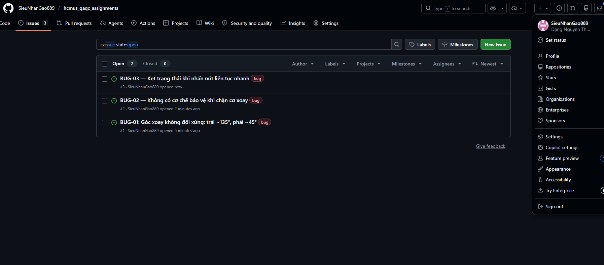

---

### 3.5 Video Demo
Video demo chi tiết hơn 5 test case trên:
| Video | Test Case | Kết quả | YouTube Link |
|-------|-----------|---------|-------------|
| V1 | TC01, TC02, TC03 | PASS | https://youtu.be/otHns2-cWM0 |
| V2 | TC12 — mất điện | PASS | https://youtu.be/mqveIGXBW-k |
| V3 | TC13 — góc xoay | FAIL | https://youtu.be/X_yEAm1IAY0 |
| V4 | TC14 — chặn cơ xoay | FAIL | https://youtu.be/TCsW4JN3SrM |
| V5 | TC15 — nhấn nút nhanh | FAIL | https://youtu.be/cvmIoLzv9t4 |
| V6 | TC16 — lắc chân đế | PASS | https://youtu.be/x5ulmZUWYV4 |

## 4. AI Critique
Sau quá trinh thực hiện HW01, em thấy AI có những hạn chế rõ ràng khi áp dụng vào kiểm thử thực tế như: 

1. Với Requirement 3, ChatGPT sinh đủ 15 test case đủ các chức năng cơ bản của quạt theo đúng happy path — bật tắt, chuyển tốc độ, xoay. Tuy nhiên AI không lấy được các tình huống tương tác vật lý phổ biến ở sinh hoạt thông thường nhưu chạn cơ xoay hay nhấn liên tục. Lý do cốt lỗi là AI không có kinh nghiệm thực tế với thiết bị vật lý không biết người dùng tương tác ra sao nên đây là giới hạn của AI trong Experience-based Testing của chuẩn ISTQB.

2. Với Requirement 1, thì Claude sinh mindmap đẹp tốt và đầy đủ nhưng có 3 lỗi cũng đang kể là đặt white-box testing techniques ngang hàng với black-box testing trong cùng 1 phạm vi Tester trong khi White-box test thuộc UnitTesting của Developer. Ngoài ra còn có đặt "Evaluate exit criteria" vào Test Completion thay vì Test Monitoring & Control nơi nó phải chạy liên tục. Và cuối dùng tách QA/QC roles thành nhánh độc lập riêng ko liện hệ được vào từng bước của chuẩn ISTQB.

3. Với Requirement 2, thì ChatGPT sinh đủ 20 defect nổi bật trong ngành phần mềm nhưng có một số lỗi chưa thực sự chính xác về mặt kỹ thuật hoặc có bias trong phân tích root cause như đã trình bày chi tiết ở phần AI Hallucination/Bias của từng defect. Các đường dẫn trích xuất cũng nhiều cái không tồn tại hoặc không chính xác, cho thấy AI có xu hướng làm giả thông tin để phù hợp với pattern chung thay vì dựa trên nguồn cụ thể.

Những lõi này cho thấy AI hiểu lý thuyết ở mức tổng quát nhưng để đủ về ngữ cảnh vận hành thực tế thì chưa nên AI phù hợp sinh nhanh test case happy path và tiết kiệm thời gian ở giai đoạn đầu, nhưng không thể thay thể tester trong Experience-based Testing và phân tích giới hạn vật lý của thiết bị thực tế hay rộng hơn là kiến thức thực tế như giao tiếp, quản lý dự án, phân tích rủi ro, v.v.. Vậy nên khi thao tác với AI, tester cần phải có kiến thức chuyên môn vững để review, chỉnh sửa và bổ sung thêm các test case và tự đặt câu hỏi AI có bỏ sót gì chỉ người dùng thực thế mới biết mới có thể phát hiện được hay không.

## 5. Mandatory Disclosures
15 test case cho quạt đứng nhỏ Yanfan (Req 3) lúc đầu được sinh bởi ChatGPT GPT-4o. Em đã review toàn bộ, chỉnh sửa và bổ sung thêm 3 edge case TC13, TC14, TC15, TC16 mà AI bỏ sót. Mindmap ISTQB ban đầu được sinh bởi Claude Sonnet 4.6, Em đã tìm ra 3 lỗi và sửa lại toàn bộ cấu trúc. AI Impact Analysis (Req 1) và phân tích AI bias/hallucination (Req 2) được hỗ trợ bởi Claude và Gemini Sidebar, Em đã tự viết lại và xác minh độc lập từng trường hợp. AI Critique, Mandatory Disclosure, Prompt Log và toàn bộ ảnh chụp/video được thực hiện hoàn toàn bởi bản thân em. Báo cáo AI Audit Report chi tiết được đính kèm tại Appendix A. Em xác nhận không sử dụng AI để tạo ra các artifact thuộc danh mục bị cấm bao gồm: ảnh thiết bị kèm thẻ sinh viên, 6 video demo có lồng tiếng, 10 screenshot job postings có tên tài khoản, và prompt log có timestamp.

## 6. Self-Assessment 
| No. | Criteria | Grade | Self-Assessed Grade |
| :--- | :--- | :---: | :---: |
| **1** | Job Market 2026+ (10 jobs $\times$ 3 pts + AI Impact) | 40 | 40 |
| **2** | Software Defects 2022-2026 (20 defects) | 20 | 20 |
| **3** | Physical-product test design (15 TCs + 5 videos) | 25 | 25 |
| **AI-1** | [AI-02] AI Audit Report (5-section) attached | 8 | 8 |
| **AI-2** | AI Critique 200-300 words + [AI-03] Disclosure attached | 4 | 4 |
| **AI-3** | [AI-05] Checklist signed + anti-cheat artifacts | 3 | 3 |
| | **Total** | **100** | 100 |